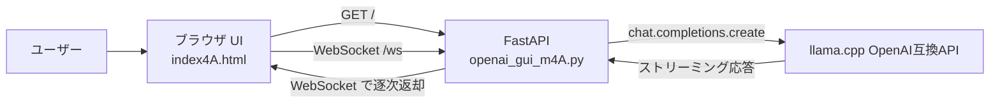
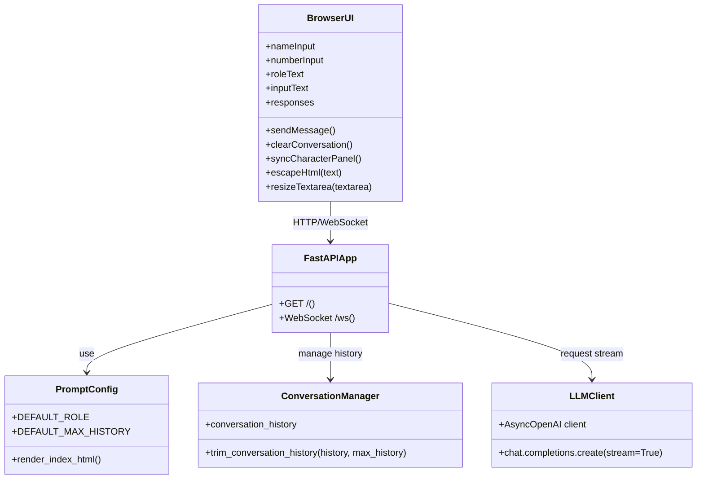
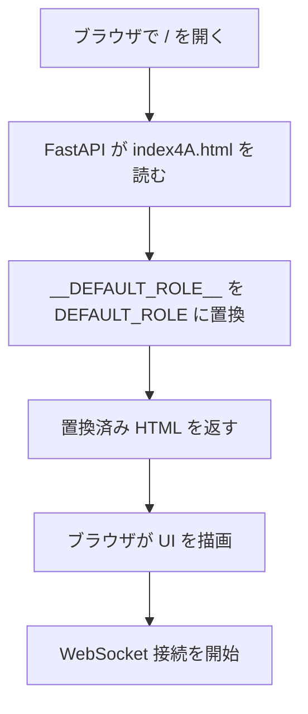
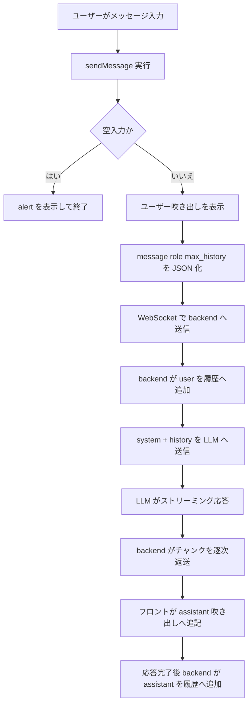
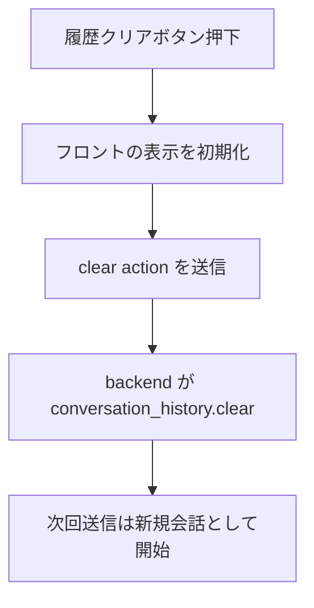

# day1_5 実装ドキュメント

## 1. 目的

day1_5 は、day1 で作成した LLM 対話ロジックをブラウザから扱えるようにした GUI アプリです。

day1 の本質は次の 3 点です。

- system メッセージとしてキャラクタロールを与える
- user / assistant の対話履歴を保持する
- その履歴を含めて LLM に問い合わせる

day1_5 では、この構造を維持したまま、以下を追加しています。

- ブラウザ UI
- WebSocket によるストリーミング応答表示
- キャラクタ画像と設定パネル
- 会話履歴件数の GUI 入力

そのため、day1_5 は「day1 の履歴付き会話スクリプトを GUI 化したもの」と位置づけられます。

## 2. ファイル構成

- openai_gui_m4A.py
  - FastAPI バックエンド
  - HTML 配信
  - WebSocket 受付
  - 既定ロール注入
  - 会話履歴保持
  - LLM ストリーミング呼び出し
- static/index4A.html
  - HTML / JavaScript / CSS をまとめたフロントエンド
  - キャラクタ設定入力
  - チャット送受信
  - ストリーミング表示
- requirements.txt
  - 必要な Python パッケージ一覧
- static/assets/characters/momo_music.jpg
  - キャラクタ画像

## 3. アーキテクチャ概要

### 3.1 全体像



### 3.2 責務分離

- フロントエンドの責務
  - ユーザー入力を受け取る
  - キャラクタ名やロール欄を表示する
  - 送信内容を JSON 化して backend に渡す
  - 受信したチャンクを吹き出しへ追記する
- バックエンドの責務
  - 既定ロールを一元管理する
  - 会話履歴を structured history として持つ
  - LLM に対して `system + history` の形で送信する
  - ストリーミング結果をフロントへ返す

## 4. day1 との対応関係

day1 の基準実装では、以下の構造で LLM に問い合わせています。

1. `SYSTEM_ROLE` を用意する
2. `conversation_history` に user を追加する
3. `messages = [{"role": "system", ...}] + conversation_history` を作る
4. LLM に送る
5. assistant の応答を履歴へ追加する

day1_5 でも同じ流れを採用しています。

- role の元データは backend の `DEFAULT_ROLE`
- 履歴は backend の `conversation_history`
- 送信メッセージは `system + history`
- 応答完了後に assistant を履歴へ追加

違いは、day1 が CLI であるのに対して、day1_5 は WebSocket 経由でブラウザと接続している点だけです。

## 5. バックエンド詳細

### 5.1 設定値

バックエンドでは、環境変数から次を読み取ります。

- `LLM_BASE_URL`
- `LLM_API_KEY`
- `LLM_MODEL`
- `APP_HOST`
- `APP_PORT`

また、day1 相当の既定値として次を持ちます。

- `DEFAULT_MAX_HISTORY`
- `DEFAULT_ROLE`

この `DEFAULT_ROLE` が、アプリ全体で使う既定キャラクタロールの唯一の定義です。

### 5.2 既定ロールの一元管理

以前は HTML 側にも同じロール文章を埋め込める構成でしたが、現在は backend の `DEFAULT_ROLE` だけを正本にしています。

処理は次の通りです。

1. HTML ファイルを文字列として読む
2. `__DEFAULT_ROLE__` を `DEFAULT_ROLE` に置換する
3. 置換後の HTML を返す

これにより、表示される初期ロールと、backend が fallback として使う既定ロールが常に一致します。

### 5.3 WebSocket 処理

WebSocket では、接続ごとに会話履歴を保持します。

```text
conversation_history = [
  {"role": "user", "content": "..."},
  {"role": "assistant", "content": "..."},
]
```

受信する主な JSON は 2 種類です。

- 通常会話

```json
{
  "action": "chat",
  "message": "こんにちは",
  "role": "# Role ...",
  "max_history": 5
}
```

- 履歴クリア

```json
{
  "action": "clear"
}
```

### 5.4 履歴の追加順序

通常会話では以下の順で動作します。

1. user メッセージを受信
2. `conversation_history` に user を追加
3. 履歴上限を超えていれば古い履歴を削除
4. `system + conversation_history` を LLM に送信
5. ストリームを受けながら `full_response` を連結
6. assistant 応答を履歴へ追加
7. 再度、履歴上限を超えていれば古い履歴を削除

この順序は day1 の履歴付き実装と同じ考え方です。

例外時には、assistant 応答を履歴へ追加できなかった場合に限って、直前に追加した user 履歴を巻き戻します。

これにより、履歴の末尾が user だけで終わる不整合を避けています。

### 5.5 ストリーミング応答

backend は `AsyncOpenAI` の `stream=True` を使っています。

そのため、応答全文を待ってから返すのではなく、チャンクごとにフロントへ送れます。

この設計により、ユーザーは回答が生成される様子を逐次確認できます。

## 6. フロントエンド詳細

### 6.1 UI 構成

画面は大きく 2 カラムです。

- 左カラム: キャラクタ設定パネル
- 右カラム: チャットパネル

左カラムには次の要素があります。

- キャラクタ画像
- キャラクタ名入力
- 会話ターン記憶数入力
- キャラクタロール textarea
- 履歴クリアボタン

右カラムには次の要素があります。

- 応答表示エリア
- ユーザー入力 textarea
- 送信ボタン

### 6.2 フロント状態管理

フロント側の状態は必要最低限に絞っています。

- `isFirstResponse`
  - assistant の新しい吹き出しを最初のチャンク時にだけ作るためのフラグ
- `assistantName`
  - 吹き出しラベルに表示するキャラクタ名

以前あった以下のような疑似履歴用変数は削除済みです。

- `conversationLogs`
- `savedRoleMessage`
- `singleTurn`
- `lastMessage`
- `lastChunk`

これにより、履歴の正本は backend だけになり、責務が明確になっています。

### 6.3 送信処理

フロントの `sendMessage()` は次の役割を持ちます。

1. 入力欄の値を読む
2. 空送信を防ぐ
3. ユーザー吹き出しを画面へ追加する
4. backend へ JSON を送る

送信データは次の 4 項目です。

- `action`
- `message`
- `role`
- `max_history`

つまり、フロントは「最新の入力値を送る」ことに集中し、履歴の構築は backend に任せています。

### 6.4 受信処理

`ws.onmessage` では、assistant 応答の最初のチャンクで吹き出しを 1 個作り、以降のチャンクはその中へ追記します。

この方式により、チャンクごとに吹き出しが分裂せず、自然なストリーミング表示になります。

### 6.5 キャラクタロール欄の高さ制御

ロール欄は長文になるため、通常入力欄とは別扱いにしています。

- 通常の入力欄
  - 自動伸長
- ロール欄
  - 自動伸長の対象外
  - 表示高さは CSS で制御
  - 長い内容は欄内スクロール

これにより、ロール欄が左パネルの外へはみ出す問題を防いでいます。

## 7. クラス図相当の構成図

このアプリは厳密なクラス設計ではなく、モジュールと関数の組み合わせで構成されています。以下はクラス図相当の構造図です。



## 8. 処理フロー図

### 8.1 初期表示フロー



### 8.2 チャット送信フロー



### 8.3 履歴クリアフロー



## 9. 設計上の判断

### 9.1 backend で履歴を持つ理由

フロントで履歴文字列を作る方式も可能ですが、それでは day1 の構造とずれます。

backend 側で `user` / `assistant` の配列を持つことで、以下の利点があります。

- day1 と同じメッセージ構造になる
- 履歴の責務が backend に集約される
- フロントの状態が単純になる
- 将来 REST API や別 UI に差し替えやすい

### 9.2 role を backend 正本にした理由

ロール文字列をフロントとバックエンドに重複して持つと、修正時にずれやすくなります。

そこで `DEFAULT_ROLE` を backend に一本化し、初期表示時だけ HTML に差し込む形にしています。

### 9.3 WebSocket を使う理由

day1 の CLI 版ではストリーミング出力を標準出力へ順次表示していました。GUI でも同じ体験を維持するには、HTTP の一括応答より WebSocket の方が自然です。

そのため、通信方式は WebSocket ですが、会話ロジック自体は day1 の延長にあります。

## 10. 既知の注意点

- 会話履歴は WebSocket 接続単位で保持しているため、ページ再読み込みで失われます
- ロール欄を大きく変更した後に履歴を残したまま会話すると、旧文脈と新ロールが混ざった応答になることがあります

## 11. まとめ

day1_5 は、day1 の対話ロジックを壊さずに GUI 化したアプリです。

設計の要点は次の通りです。

- system role は backend の `DEFAULT_ROLE` に一元化
- 会話履歴は backend で structured history として保持
- フロントは入力と表示に集中
- WebSocket によりストリーミング表示を実現
- 画面構成は AI キャラクタ会話アプリとして整理

この構成により、day1 の本質である「キャラクタロール付き履歴会話」を、ブラウザ上で扱いやすい形に拡張しています。
